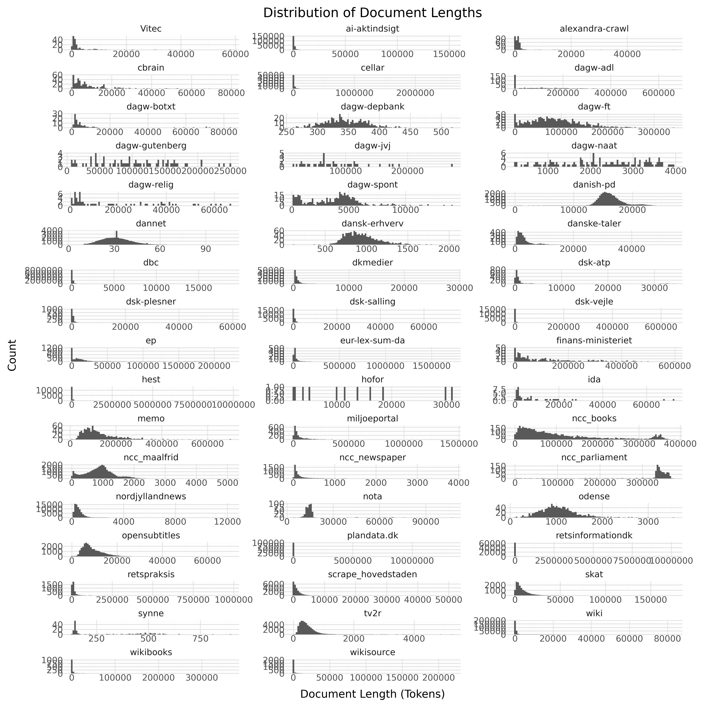

<!-- 
readme structure is inspired by:
https://github.com/huggingface/datasets/blob/main/templates/README_guide.md 
-->


# 🧨 DFM Datasheets


<!-- START README TABLE -->
|              |                                                                                                                                          |
| ------------ | ---------------------------------------------------------------------------------------------------------------------------------------- |
| **Version**  | 0.0.1                                                                                                                                    |
| **Language** | dan, dansk, Danish                                                                                                                       |
| **License**  | Non publicly available                                                                                                                   |
| **Models**   | Currently not model is publicly available that is trained on the data                                                                    |
| **Contact**  | If you have question about this project please create an issue [here](https://github.com/danish-foundation-models/dfm-datasheets/issues) |

<!-- END README TABLE -->

## Table of Contents
- [🧨 DFM Datasheets](#-dfm-datasheets)
  - [Table of Contents](#table-of-contents)
  - [Dataset Description](#dataset-description)
    - [Summary](#summary)
    - [Languages:](#languages)
  - [Dataset Structure](#dataset-structure)
    - [Data Instances](#data-instances)
    - [Data Fields](#data-fields)
    - [Data Splits](#data-splits)
  - [Dataset Creation](#dataset-creation)
    - [Curation Rationale](#curation-rationale)
    - [Annotations](#annotations)
    - [Source Data](#source-data)
    - [Dataset Statistics](#dataset-statistics)
  - [Additional Information](#additional-information)
    - [Contributing to the dataset](#contributing-to-the-dataset)
    - [Citation Information](#citation-information)
    - [Disclaimer](#disclaimer)
    - [Notice and take down policy](#notice-and-take-down-policy)

## Dataset Description

<!-- START-DESC-STATS -->
- **Language**: dan, dansk, Danish
- **Number of samples**: 588.92K
- **Number of tokens (Llama 3)**: 1.85B
- **Average document length (characters)**: 9245.09
<!-- END-DESC-STATS -->


### Summary

The DFM Datasheets is a collection of datasheets for the subsection of data used for [Danish Foundation Models](https://www.foundationmodels.dk) that can't be shared publicly under open-licenses. This repository ensure documentation to data along with FAIR
data practices.


### Languages:
This dataset includes the following languages:

- dan-Latn
- dan-Latn-bornholm
- dan-Latn-synnejyl

Language is denoted using [BCP-47](https://en.wikipedia.org/wiki/IETF_language_tag), using the langauge code ISO 639-3 and the script code ISO 15924. The last element denote the region variant.

## Dataset Structure

The dataset contains text from different sources which are thoroughly defined in [Source Data](#source-data).

### Data Instances

Each entry in the dataset consists of a single text with associated metadata

```py
{
  "text": "SAMLEDE VÆRKER\n\nJEPPE AAKJÆR GYLDENDALSKE BOGHANDEL - NORDISK FORLAG KJØBENHAVN OG\nKRISTIANIA 1919 0[...]",
  "source": "adl",
  "id": "adl_aakjaer06val",
  "added": "2020-09-14",
  "created": "1700-01-01, 2022-01-01",
  "license": "Creative Commons Legal Code\n\nCC0 1.0 Universal",
  "domain": "Wiki & Books",
  "metadata": {
    "source-pretty": "Archive for Danish Literature"
  }
}
```

> Note: This example is take for Danish Dynaword, which is publicly available [here](https://huggingface.co/datasets/danish-foundation-models/danish-dynaword)

### Data Fields

An entry in the dataset consists of the following fields:

- `text`(`str`): The content of the document.
- `source` (`str`): The source of the document (see [Source Data](#source-data)).
- `id` (`str`): An unique identifier for each document.
- `added` (`str`): An date for when the document was added to this collection.
- `created` (`str`): An date range for when the document was originally created.
- `license` (`str`): The license of the document. The licenses vary according to the source. 
- `domain` (`str`): The domain of the source
- `metadata/source-pretty` (`str`): The long form version of the short-form source name
- `metadata/*`: Potentially additional metadata

### Data Splits

The entire corpus is provided in the `train` split.

## Dataset Creation

### Curation Rationale

These datasets were collected and curated with the intention of making large quantities of Danish text data available. While this was collected with the intention of developing language models it is likely to have multiple other uses such as examining language development and differences across domains. 

### Annotations

This data generally contains no annotation besides the metadata attached to each sample such as what domain it belongs to. 

### Source Data

Below follows a brief overview of the sources in the corpus along with their individual license.

<!-- START-MAIN TABLE -->
| Source              | Description                                                                                                                  | N. Tokens | License                |
| :------------------ | :--------------------------------------------------------------------------------------------------------------------------- | :-------- | :--------------------- |
| [memo]              | The MeMo corpus comprising almost all Danish novels from the period 1870-1899, known as the Modern Breakthrough              | 9.28M     | [CC-BY-SA 4.0]         |
| [opensubtitles]     | Danish subsection of [OpenSubtitles](https://opus.nlpl.eu/OpenSubtitles/corpus/version/OpenSubtitles)                        | 271.60M   | [CC-0]                 |
| [retsinformationdk] | [retsinformation.dk](https://www.retsinformation.dk) (legal-information.dk) the official legal information system of Denmark | 516.54M   | [Danish Copyright Law] |
| [ep]                | The Danish subsection of [Europarl](https://aclanthology.org/2005.mtsummit-papers.11/)                                       | 100.89M   | [CC-0]                 |
| [ft]                | Records from all meetings of The Danish parliament (Folketinget) in the parliament hall                                      | 114.09M   | [CC-0]                 |
| [wikisource]        | The Danish subsection of [Wikisource](https://en.wikisource.org/wiki/Main_Page)                                              | 5.34M     | [CC-0]                 |
| [spont]             | Conversational samples collected as a part of research projects at Aarhus University                                         | 1.56M     | [CC-0]                 |
| [tv2r]              | Contemporary Danish newswire articles published between 2010 and 2019                                                        | 21.67M    | [CC-BY-SA 4.0]         |
| [adl]               | Danish literature from 1700-2023 from the Archive for Danish Literature (ADL)                                                | 58.49M    | [CC-0]                 |
| [hest]              | Samples from the Danish debate forum www.heste-nettet.dk                                                                     | 389.33M   | [CC-0]                 |
| [skat]              | Skat is the Danish tax authority. This dataset contains content from its website skat.dk                                     | 122.12M   | [CC-0]                 |
| [dannet]            | [DanNet](https://cst.ku.dk/projekter/dannet) is a Danish WordNet                                                             | 1.52M     | [DanNet 1.0 License]   |
| [retspraksis]       | Case law or judical practice in Denmark derived from [Retspraksis](https://da.wikipedia.org/wiki/Retspraksis)                | 57.08M    | [CC-0]                 |
| [wikibooks]         | The Danish Subsection of [Wikibooks](https://www.wikibooks.org)                                                              | 6.24M     | [CC-0]                 |
| [jvj]               | The works of the Danish author and poet, [Johannes V. Jensen](https://da.wikipedia.org/wiki/Johannes_V._Jensen)              | 3.55M     | [CC-BY-SA 4.0]         |
| [gutenberg]         | The Danish subsection from Project [Gutenberg](https://www.gutenberg.org)                                                    | 6.76M     | [Gutenberg License]    |
| [botxt]             | The Bornholmsk Ordbog Dictionary Projec                                                                                      | 847.97K   | [CC-0]                 |
| [depbank]           | The Danish subsection of the [Universal Dependencies Treebank](https://github.com/UniversalDependencies/UD_Danish-DDT)       | 185.45K   | [CC-BY-SA 4.0]         |
| [naat]              | Danish speeches from 1930-2022                                                                                               | 286.68K   | [CC-0]                 |
| [synne]             | Dataset collected from [synnejysk forening's website](https://www.synnejysk.dk), covering the Danish dialect sønderjysk      | 52.51K    | [CC-0]                 |
| [wiki]              | The Danish subsection of [wikipedia](https://en.wikipedia.org/wiki/Main_Page)                                                | 122.00M   | [CC-0]                 |
| [nordjyllandnews]   | Articles from the Danish Newspaper [TV2 Nord](https://www.tv2nord.dk)                                                        | 37.91M    | [CC-0]                 |
| [relig]             | Danish religious text from the 1700-2022                                                                                     | 1.24M     | [CC-0]                 |
| [nota]              | The text only part of the [Nota lyd- og tekstdata](https://sprogteknologi.dk/dataset/nota-lyd-og-tekstdata) dataset          | 7.30M     | [CC-0]                 |
| **Total**           |                                                                                                                              | 1.86B     |                        |

[memo]: data/memo/memo.md
[opensubtitles]: data/opensubtitles/opensubtitles.md
[retsinformationdk]: data/retsinformationdk/retsinformationdk.md
[ep]: data/ep/ep.md
[ft]: data/ft/ft.md
[wikisource]: data/wikisource/wikisource.md
[spont]: data/spont/spont.md
[tv2r]: data/tv2r/tv2r.md
[adl]: data/adl/adl.md
[hest]: data/hest/hest.md
[skat]: data/skat/skat.md
[dannet]: data/dannet/dannet.md
[retspraksis]: data/retspraksis/retspraksis.md
[wikibooks]: data/wikibooks/wikibooks.md
[jvj]: data/jvj/jvj.md
[gutenberg]: data/gutenberg/gutenberg.md
[botxt]: data/botxt/botxt.md
[depbank]: data/depbank/depbank.md
[naat]: data/naat/naat.md
[synne]: data/synne/synne.md
[wiki]: data/wiki/wiki.md
[nordjyllandnews]: data/nordjyllandnews/nordjyllandnews.md
[relig]: data/relig/relig.md
[nota]: data/nota/nota.md


[CC-0]: https://creativecommons.org/publicdomain/zero/1.0/legalcode.en
[CC-BY-SA 4.0]: https://creativecommons.org/licenses/by-sa/4.0/deed.en
[Danish Copyright Law]: ./data/retsinformationdk/retsinformationdk.md#license-information
[DanNet 1.0 License]: ./data/dannet/dannet.md#license-information
[Gutenberg License]: ./data/gutenberg/gutenberg.md#license-information
<!-- END-MAIN TABLE -->


You can learn more about each dataset by pressing 

<!-- ### Quality Control

Dynaword performs quality checks along with each PR. These quality checks includes:
- ensuring unique ids
TODO:
- checking for duplicates 
-->


### Dataset Statistics

<!-- START-DATASET PLOTS -->


<!-- END-DATASET PLOTS -->


## Additional Information

### Contributing to the dataset

We welcome contributions to the dataset such as new sources, better data filtering and so on. To get started on contributing please see [the contribution guidelines](CONTRIBUTING.md)

### Citation Information

This version expand upon existing dataset sources such as the [Danish gigaword](https://huggingface.co/danish-foundation-models). We recommend that you cite the source of the dataset when using these datasets.

###  Disclaimer
We do not own any of the text from which the data has been extracted.
We only offer files that we believe we are free to redistribute. If any doubt occurs about the legality of any of our file downloads we will take them off right away after [contacting us](https://huggingface.co/datasets/danish-foundation-models/danish-dynaword/discussions/new).

### Notice and take down policy
Notice: Should you consider that our data contains material that is owned by you and should therefore not be reproduced here, please:

- Clearly identify yourself, with detailed contact data such as an address, telephone number or email address at which you can be contacted.
- Clearly identify the copyrighted work claimed to be infringed.
- Clearly identify the material that is claimed to be infringing and information reasonably sufficient to allow us to locate the material.

You can contact us through [this channel](https://huggingface.co/datasets/danish-foundation-models/danish-dynaword/discussions/new).

Take down: We will comply to legitimate requests by removing the affected sources from the next release of the corpus.

---

<h3 style="display: flex; align-items: center;">
  <a href="https://www.foundationmodels.dk">
    
  </a>
  A&nbsp;<a href=https://www.foundationmodels.dk>Danish Foundation Models</a>&nbsp;dataset
</h3>