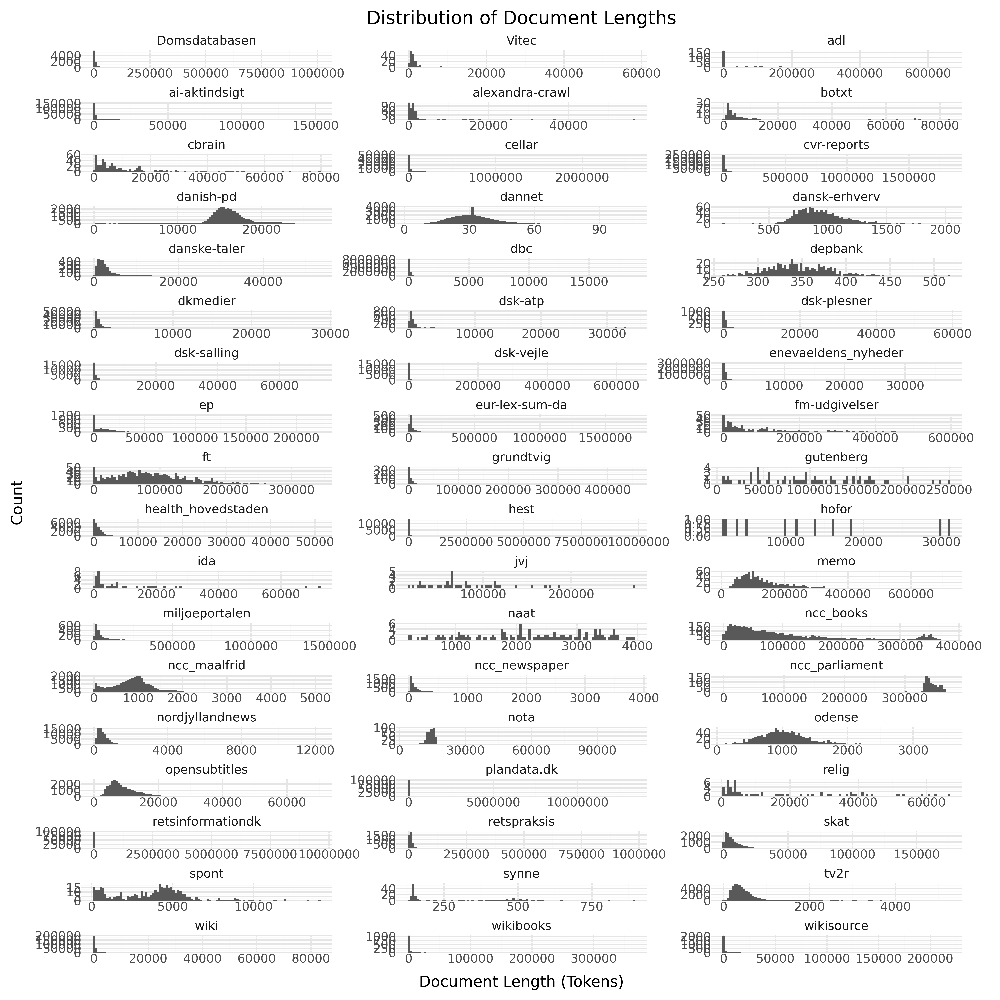

# DFM Datasheets

This repository contains the datasheets for DFM. This repostory documents.

<!-- START README TABLE -->
|             |                                                                                                                                          |
|-------------|------------------------------------------------------------------------------------------------------------------------------------------|
| **Version** | 0.0.10 ([Changelog](/CHANGELOG.md)) |
| **License** | Non publicly available                                                                                                                   |
| **Models**  | Currently not model is publicly available that is trained on the data                                                                    |
| **Contact** | If you have question about this project please create an issue [here](https://github.com/danish-foundation-models/dfm-datasheets/issues) |
<!-- END README TABLE -->

## Table of Contents
- [DFM Datasheets](#dfm-datasheets)
  - [Table of Contents](#table-of-contents)
  - [Dataset Description](#dataset-description)
    - [Summary](#summary)
    - [Curation Rationale](#curation-rationale)
    - [Dataset Overview](#dataset-overview)
  - [Additional Information](#additional-information)
    - [Citation Information](#citation-information)
    - [Disclaimer](#disclaimer)
    - [Notice and take down policy](#notice-and-take-down-policy)

## Dataset Description

<!-- START-DESC-STATS -->
- **Language**: dan, dansk, Danish
- **Number of samples**: 11.30M
- **Number of tokens (Llama 3)**: 6.82B
- **Average document length (characters)**: 1973.23
<!-- END-DESC-STATS -->

### Summary

The DFM Datasheets is a collection of datasheets for datasets used for [Danish Foundation Models](https://www.foundationmodels.dk). This repository ensure documentation to data along with FAIR data practices.

### Curation Rationale

These datasets were collected and curated with the intention of developing language models for Danish.

### Dataset Overview

We generally split the dataset into two categories: Public release sources and research sources. 

<!-- START-MAIN TABLE -->
| Source               | Description                                                                                                                                                                                             | Domain       | N. Tokens   | License                                           |
|:---------------------|:--------------------------------------------------------------------------------------------------------------------------------------------------------------------------------------------------------|:-------------|:------------|:--------------------------------------------------|
| [cellar]             | The official digital repository for European Union legal documents and open data                                                                                                                        | Legal        | 1.15B       | [CC-BY-SA 4.0]                                    |
| [plandata]           | A comprehensive dataset consisting of municipal planning documents from across Denmark, including local development plans, municipal plans, planning strategies, and related document types             | Governmental | 1.03B       | [Written agreement (public models, private data)] |
| [dbc-abstracts]      | dbc-abstracts consists of more than 11.6 million abstracts of books and other materials collected and created by DBC D1G1TAL (former Dansk Bibliotekscenter)                                            | Books        | 694.42M     | [Written agreement (public models, private data)] |
| [danish-pd]          | **Danish-Public Domain** or **Danish-PD** is a large collection aiming to aggregate all Danish monographies and periodicals in the public domain                                                        | Books        | 532.43M     | [Public Domain]                                   |
| [ncc_books]          | Danish books extracted from the [Norwegian Colossal Corpus](https://huggingface.co/datasets/NbAiLab/NCC) derived from OCR                                                                               | Books        | 531.97M     | [CC-0]                                            |
| [retsinformationdk]  | [retsinformation.dk](https://www.retsinformation.dk) (legal-information.dk) the official legal information system of Denmark                                                                            | Legal        | 516.35M     | [Danish Copyright Law]                            |
| [hest]               | Samples from the Danish debate forum www.heste-nettet.dk                                                                                                                                                | Social Media | 389.32M     | [CC-0]                                            |
| [ncc_parliament]     | Collections from the Norwegian parliament in Danish. Extracted from the [Norwegian Colossal Corpus](https://huggingface.co/datasets/NbAiLab/NCC) derived from ocr                                       | Other        | 338.87M     | [NLOD 2.0]                                        |
| [opensubtitles]      | Danish subsection of [OpenSubtitles](https://opus.nlpl.eu/OpenSubtitles/corpus/version/OpenSubtitles)                                                                                                   | Conversation | 271.60M     | [CC-0]                                            |
| [ai-aktindsigt]      | Multiple web scrapes from municipality websites collected as a part of the [AI-aktindsigt](https://ai-aktindsigt.dk) project                                                                            | Web          | 139.23M     | [Apache 2.0]                                      |
| [miljoeportalen]     | Data from [Danmarks Miljøportalen](https://www.miljoeportal.dk/om-danmarks-miljoeportal/) (Denmark's Environment Portal)                                                                                | Legal        | 127.38M     | [CC-0]                                            |
| [skat]               | Skat is the Danish tax authority. This dataset contains content from its website skat.dk                                                                                                                | Legal        | 122.11M     | [CC-0]                                            |
| [wiki]               | The Danish subsection of [wikipedia](https://en.wikipedia.org/wiki/Main_Page)                                                                                                                           | Encyclopedic | 122.00M     | [CC-0]                                            |
| [ft]                 | Records from all meetings of The Danish parliament (Folketinget) in the parliament hall                                                                                                                 | Conversation | 114.09M     | [CC-0]                                            |
| [memo]               | The MeMo corpus comprising almost all Danish novels from the period 1870-1899, known as the Modern Breakthrough                                                                                         | Books        | 110.23M     | [CC-BY-SA 4.0]                                    |
| [ep]                 | The Danish subsection of [Europarl](https://aclanthology.org/2005.mtsummit-papers.11/)                                                                                                                  | Conversation | 100.84M     | [CC-0]                                            |
| [dsk-dkmedier]       | A collection of ~100K news articles from [DK Medier](https://dkmedier.dk), written in the period 2000-2024                                                                                              | News         | 65.33M      | [DSK-1]                                           |
| [adl]                | Danish literature from 1700-2023 from the [Archive for Danish Literature](https://tekster.kb.dk/text?editorial=no&f%5Bsubcollection_ssi%5D%5B%5D=adl&match=one&search_field=Alt) (ADL)                  | Books        | 58.49M      | [CC-0]                                            |
| [retspraksis]        | Case law or judical practice in Denmark derived from [Retspraksis](https://da.wikipedia.org/wiki/Retspraksis)                                                                                           | Legal        | 56.26M      | [CC-0]                                            |
| [dbc-reviews]        | dbc-reviews consists of more than 214 thousand reviews of books and other materials collected and created by DBC D1G1TAL (former Dansk Bibliotekscenter)                                                | Books        | 53.96M      | [Written agreement (public models, private data)] |
| [fm-udgivelser]      | The official publication series of the Danish Ministry of Finance containing economic analyses, budget proposals, and fiscal policy documents                                                           | Legal        | 50.33M      | [CC-BY-SA 4.0]                                    |
| [nordjyllandnews]    | Articles from the Danish Newspaper [TV2 Nord](https://www.tv2nord.dk)                                                                                                                                   | News         | 37.90M      | [CC-0]                                            |
| [eur-lex-sum-da]     | The Danish subsection of EUR-lex SUM consisting of EU legislation paired with professionally written summaries                                                                                          | Legal        | 31.37M      | [CC-BY-SA 4.0]                                    |
| [ncc_maalfrid]       | Danish content from Norwegian institutions websites                                                                                                                                                     | Web          | 29.26M      | [NLOD 2.0]                                        |
| [dsk-vejle]          | A collection of crawled webpages that is managed by Vejle Kommune. Contains various information, covering everything from tourists to garbage collection to historical knowledge of the area            | Web          | 27.99M      | [DSK-1]                                           |
| [scrape_hovedstaden] | Digitaliseringsstyrelsen udgiver ét datasæt på baggrund af offentliggjorte tekster fra Region Hovedstadens dokumentsamling                                                                              | Encyclopedic | 27.04M      | [CC-0]                                            |
| [tv2r]               | Contemporary Danish newswire articles published between 2010 and 2019                                                                                                                                   | News         | 21.67M      | [CC-BY-SA 4.0]                                    |
| [dsk-salling]        | A collection of crawled webpages that is managed by Salling Group. The dataset consists mainly of product pages from online stores such as bilka.dk, br.dk and such. The data consists of ~24K webpages | Web          | 9.79M       | [DSK-1]                                           |
| [danske-taler]       | Danish Speeches from [dansketaler.dk](https://www.dansketaler.dk)                                                                                                                                       | Conversation | 8.23M       | [CC-0]                                            |
| [nota]               | The text only part of the [Nota lyd- og tekstdata](https://sprogteknologi.dk/dataset/nota-lyd-og-tekstdata) dataset                                                                                     | Readaloud    | 7.30M       | [CC-0]                                            |
| [gutenberg]          | The Danish subsection from Project [Gutenberg](https://www.gutenberg.org)                                                                                                                               | Books        | 6.76M       | [Gutenberg]                                       |
| [wikibooks]          | The Danish Subsection of [Wikibooks](https://www.wikibooks.org)                                                                                                                                         | Books        | 6.24M       | [CC-0]                                            |
| [wikisource]         | The Danish subsection of [Wikisource](https://en.wikisource.org/wiki/Main_Page)                                                                                                                         | Encyclopedic | 5.34M       | [CC-0]                                            |
| [dsk-cbrain]         | A collection of Marketing material, product guides, and datasheets produced by cBrain for their products                                                                                                | Other        | 4.19M       | [DSK-1]                                           |
| [jvj]                | The works of the Danish author and poet, [Johannes V. Jensen](https://da.wikipedia.org/wiki/Johannes_V._Jensen)                                                                                         | Books        | 3.55M       | [CC-BY-SA 4.0]                                    |
| [dsk-atp]            | A collection of crawled webpages that is managed by ATP                                                                                                                                                 | Web          | 2.86M       | [DSK-1]                                           |
| [dbc-faktalink]      | dbc-faktalink consists of more than 5 hundred articles created by DBC D1G1TAL (former Dansk Bibliotekscenter)                                                                                           | Books        | 1.99M       | [Written agreement (public models, private data)] |
| [spont]              | Conversational samples collected as a part of research projects at Aarhus University                                                                                                                    | Conversation | 1.56M       | [CC-0]                                            |
| [dannet]             | [DanNet](https://cst.ku.dk/projekter/dannet) is a Danish WordNet                                                                                                                                        | Other        | 1.48M       | [DanNet 1.0]                                      |
| [dbc-forfatterweb]   | dbc-forfatterweb consists of more than 1 thousand articles created by DBC D1G1TAL (former Dansk Bibliotekscenter)                                                                                       | Books        | 1.42M       | [Written agreement (public models, private data)] |
| [relig]              | Danish religious text from the 1700-2022                                                                                                                                                                | Books        | 1.24M       | [CC-0]                                            |
| [dsk-odense]         | A set of newsletters stories, covering events in Odense Municipality. Have been published on their website                                                                                              | News         | 1.18M       | [DSK-1]                                           |
| [dsk-danskerhverv]   | A set of newsletters written by Dansk Erhverv, primarily focusing on financials and companies world wide                                                                                                | News         | 1.12M       | [DSK-1]                                           |
| [ncc_newspaper]      | OCR'd Newspapers derived from [NCC](https://huggingface.co/datasets/NbAiLab/NCC)                                                                                                                        | News         | 1.05M       | [CC-0]                                            |
| [dsk-plesner]        | A combination of crawled webpages from Plesners own website, and a series of internal documents outlining procedures                                                                                    | Other        | 896.33K     | [DSK-1]                                           |
| [botxt]              | The Bornholmsk Ordbog Dictionary Project                                                                                                                                                                | Dialect      | 847.87K     | [CC-0]                                            |
| [dsk-alexandra]      | A collection of crawled webpages that is managed by Alexandra Institutet                                                                                                                                | Web          | 584.35K     | [DSK-1]                                           |
| [dsk-vitec]          | A collection of documents covering product descriptions, to newsletters, to internal documentation                                                                                                      | Other        | 537.07K     | [DSK-1]                                           |
| [dsk-ida]            | A collection of newsletters, articles and other texts produced by IDA                                                                                                                                   | News         | 436.74K     | [DSK-1]                                           |
| [naat]               | Danish speeches from 1930-2022                                                                                                                                                                          | Conversation | 286.55K     | [CC-0]                                            |
| [depbank]            | The Danish subsection of the [Universal Dependencies Treebank](https://github.com/UniversalDependencies/UD_Danish-DDT)                                                                                  | Other        | 184.92K     | [CC-BY-SA 4.0]                                    |
| [dsk-hofor]          | A collection of articles, guides and newsletters written by HOFOR for their customers                                                                                                                   | Other        | 143.49K     | [DSK-1]                                           |
| [synne]              | Dataset collected from [synnejysk forening's website](https://www.synnejysk.dk), covering the Danish dialect sønderjysk                                                                                 | Other        | 52.02K      | [CC-0]                                            |
| **Total**            |                                                                                                                                                                                                         |              | 6.82B       |                                                   |

[adl]: data/adl/adl.md
[botxt]: data/botxt/botxt.md
[dannet]: data/dannet/dannet.md
[depbank]: data/depbank/depbank.md
[ep]: data/ep/ep.md
[ft]: data/ft/ft.md
[gutenberg]: data/gutenberg/gutenberg.md
[hest]: data/hest/hest.md
[jvj]: data/jvj/jvj.md
[naat]: data/naat/naat.md
[relig]: data/relig/relig.md
[retsinformationdk]: data/retsinformationdk/retsinformationdk.md
[retspraksis]: data/retspraksis/retspraksis.md
[skat]: data/skat/skat.md
[spont]: data/spont/spont.md
[synne]: data/synne/synne.md
[tv2r]: data/tv2r/tv2r.md
[wiki]: data/wiki/wiki.md
[wikibooks]: data/wikibooks/wikibooks.md
[wikisource]: data/wikisource/wikisource.md
[dsk-alexandra]: data/dsk-alexandra/dsk-alexandra.md
[dsk-atp]: data/dsk-atp/dsk-atp.md
[dsk-cbrain]: data/dsk-cbrain/dsk-cbrain.md
[dsk-danskerhverv]: data/dsk-danskerhverv/dsk-danskerhverv.md
[dsk-dkmedier]: data/dsk-dkmedier/dsk-dkmedier.md
[dsk-hofor]: data/dsk-hofor/dsk-hofor.md
[dsk-ida]: data/dsk-ida/dsk-ida.md
[dsk-odense]: data/dsk-odense/dsk-odense.md
[dsk-plesner]: data/dsk-plesner/dsk-plesner.md
[dsk-salling]: data/dsk-salling/dsk-salling.md
[dsk-vejle]: data/dsk-vejle/dsk-vejle.md
[dsk-vitec]: data/dsk-vitec/dsk-vitec.md
[plandata]: data/plandata/plandata.md
[ai-aktindsigt]: data/ai-aktindsigt/ai-aktindsigt.md
[danske-taler]: data/danske-taler/danske-taler.md
[fm-udgivelser]: data/fm-udgivelser/fm-udgivelser.md
[eur-lex-sum-da]: data/eur-lex-sum-da/eur-lex-sum-da.md
[memo]: data/memo/memo.md
[miljoeportalen]: data/miljoeportalen/miljoeportalen.md
[nordjyllandnews]: data/nordjyllandnews/nordjyllandnews.md
[nota]: data/nota/nota.md
[opensubtitles]: data/opensubtitles/opensubtitles.md
[cellar]: data/cellar/cellar.md
[ncc_books]: data/ncc_books/ncc_books.md
[ncc_maalfrid]: data/ncc_maalfrid/ncc_maalfrid.md
[ncc_newspaper]: data/ncc_newspaper/ncc_newspaper.md
[ncc_parliament]: data/ncc_parliament/ncc_parliament.md
[dbc-abstracts]: data/dbc-abstracts/dbc-abstracts.md
[dbc-faktalink]: data/dbc-faktalink/dbc-faktalink.md
[dbc-forfatterweb]: data/dbc-forfatterweb/dbc-forfatterweb.md
[dbc-reviews]: data/dbc-reviews/dbc-reviews.md
[scrape_hovedstaden]: data/scrape_hovedstaden/scrape_hovedstaden.md
[danish-pd]: data/danish-pd/danish-pd.md

[CC-0]: https://creativecommons.org/publicdomain/zero/1.0/legalcode.en
[CC-BY-SA 4.0]: https://creativecommons.org/licenses/by-sa/4.0/deed.en
[Apache 2.0]: https://www.apache.org/licenses/LICENSE-2.0
[DanNet 1.0]: ./data/dannet/dannet.md#license-information
[Gutenberg]: ./data/gutenberg/gutenberg.md#license-information
[Danish Copyright Law]: ./data/retsinformationdk/retsinformationdk.md#license-information
[DSK-1]: ./data/dsk-alexandra/dsk-alexandra.md#license-information
[DSK-1]: ./data/dsk-atp/dsk-atp.md#license-information
[DSK-1]: ./data/dsk-cbrain/dsk-cbrain.md#license-information
[DSK-1]: ./data/dsk-danskerhverv/dsk-danskerhverv.md#license-information
[DSK-1]: ./data/dsk-dkmedier/dsk-dkmedier.md#license-information
[DSK-1]: ./data/dsk-hofor/dsk-hofor.md#license-information
[DSK-1]: ./data/dsk-ida/dsk-ida.md#license-information
[DSK-1]: ./data/dsk-odense/dsk-odense.md#license-information
[DSK-1]: ./data/dsk-plesner/dsk-plesner.md#license-information
[DSK-1]: ./data/dsk-salling/dsk-salling.md#license-information
[DSK-1]: ./data/dsk-vejle/dsk-vejle.md#license-information
[DSK-1]: ./data/dsk-vitec/dsk-vitec.md#license-information
[Written agreement (public models, private data)]: ./data/plandata/plandata.md#license-information
[NLOD 2.0]: ./data/ncc_maalfrid/ncc_maalfrid.md#license-information
[NLOD 2.0]: ./data/ncc_parliament/ncc_parliament.md#license-information
[Written agreement (public models, private data)]: ./data/dbc-abstracts/dbc-abstracts.md#license-information
[Written agreement (public models, private data)]: ./data/dbc-faktalink/dbc-faktalink.md#license-information
[Written agreement (public models, private data)]: ./data/dbc-forfatterweb/dbc-forfatterweb.md#license-information
[Written agreement (public models, private data)]: ./data/dbc-reviews/dbc-reviews.md#license-information
[Public Domain]: ./data/danish-pd/danish-pd.md#license-information
<!-- END-MAIN TABLE -->

<!-- **Public Release sources**: These sources include datasets that either public released under permissible licenses or where explicit permission have been given by the data owner to train and release models based on the data. The primary source for the non-public training data is [DSK](https://alexandra.dk/dsk/).

| Source            | Description                                                                                                                                                                                              | N. Tokens | License                            | Version                                                                                                     |
|:------------------|:---------------------------------------------------------------------------------------------------------------------------------------------------------------------------------------------------------|:----------|:-----------------------------------|:------------------------------------------------------------------------------------------------------------|
| [Common Corpus]   | Common Corpus is a large multilingual collection of open and permissible licensed text data                                                                                                              | 1,998B    | Various open licenses (see source) | [1.0.0](https://huggingface.co/datasets/PleIAs/common_corpus/tree/4fa82b3b7f2aed19b5b2bf7750015a9c46c1f13d) |
| [Danish Dynaword] | Danish Dynaword, is the large openly licensed collection of Danish text data                                                                                                                             | 4.26B     | Various open licenses (see source) | 1.1.0                                                                                                       |
| DK Medier         | A collection of ~100K news articles from [DK Medier](https://dkmedier.dk), written in the period 2000-2024.                                                                                              | 65.44M    | DSK-1                              | 1.0.0                                                                                                       |
| Vejle Kommune     | A collection of crawled webpages that is managed by Vejle Kommune. Contains various information, covering everything from tourists to garbage collection to historical knowledge of the area.            | 33.52M    | DSK-1                              | 1.0.0                                                                                                       |
| Salling Group     | A collection of crawled webpages that is managed by Salling Group. The dataset consists mainly of product pages from online stores such as bilka.dk, br.dk and such. The data consists of ~24K webpages. | 10.75M    | DSK-1                              | 1.0.0                                                                                                       |

[Danish Dynaword]: https://huggingface.co/datasets/danish-foundation-models/danish-dynaword
[Common Corpus]: https://huggingface.co/datasets/PleIAs/common_corpus

**Research sources**: 

Below follows a brief overview of the sources in the corpus along with their individual license.

| Source               | Description                                                               | N. Tokens | License          |
|:---------------------|:--------------------------------------------------------------------------|:----------|:-----------------|
| [AI4WELFARE KB Data] | The Danish Web Archive (Netarkivet) collected by The Royal Danish Library | 1,200B    | For internal use |

[AI4WELFARE KB Data]: data/ai4welfare-kb-data/ai4welfare-kb-data.md --> 

### Dataset Statistics
The following plot show the domains distribution of the datasets:

Per dataset histograms

<!-- START-DATASET PLOTS -->

<!-- END-DATASET PLOTS -->

## Additional Information

### Citation Information

Currently no citation information is provided.

###  Disclaimer
We do not own any of the text from which the data has been extracted.
If you believe that we are not allowed to train on any of the datasets noted please do [contact us](https://github.com/danish-foundation-models/dfm-datasheets/issues).

### Notice and take down policy
Notice: Should you consider that our data contains material that is owned by you and should therefore not be included in the training of LLMs here, please:

- Clearly identify yourself, with detailed contact data such as an address, telephone number or email address at which you can be contacted.
- Clearly identify the copyrighted work claimed to be infringed.
- Clearly identify the material that is claimed to be infringing and information reasonably sufficient to allow us to locate the material.

You can contact us by making an [issue](https://github.com/danish-foundation-models/dfm-datasheets/issues).

Take down: We will comply to legitimate requests by removing the affected sources from the next release of the corpus.

---

<h3 style="display: flex; align-items: center;">
  
  A&nbsp;<a href=https://www.foundationmodels.dk>Danish Foundation Models</a>&nbsp;dataset
</h3>
