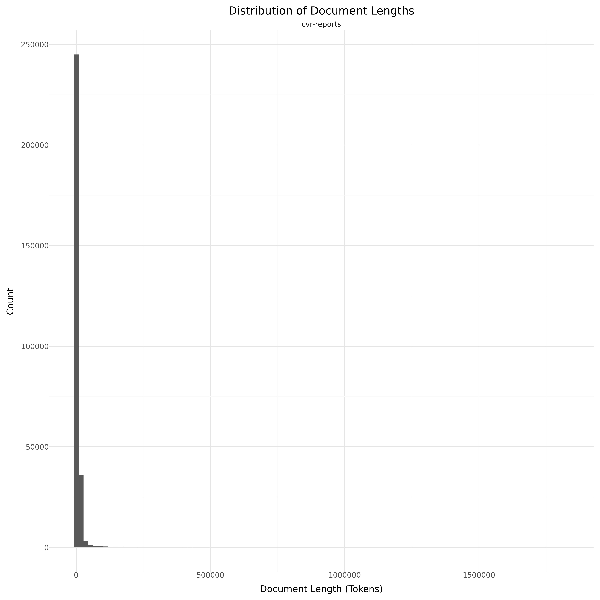

# Dataset Card for Annual Reports (CVR)

<!-- START-SHORT DESCRIPTION -->
Annual reports from danish companies in the period 2010-2025. 
<!-- END-SHORT DESCRIPTION -->

Danish companies are required by law to write up an annual report once every year. 
The report contains the financials of the company along with written statements regarding the status of the company. 

## Dataset Description

<!-- START-DESC-STATS -->
- **Language**: Danish, English
- **Domains**: Financial
- **Number of samples**: 1.32M
- **Number of tokens (Llama 3)**: 8.68B
- **Average document length (characters)**: 23942.41
<!-- END-DESC-STATS -->

## Dataset Structure
An entry in the dataset consists of the following fields:

- `id` (`str`): An unique identifier for each document.
- `text`(`str`): The content of the document.
- `source` (`str`): The source of the document (see [Source Data](#source-data)).
- `added` (`str`): An date for when the document was added to this collection.
- `created` (`str`): An date range for when the document was originally created.
- `token_count` (`int`): The number of tokens in the sample computed using the Llama 8B tokenizer

### Additional Processing

### Dataset Statistics

<!-- START-DATASET PLOTS -->

<!-- END-DATASET PLOTS -->

# Additional Information

## License Information
TBD

### Citation Information
