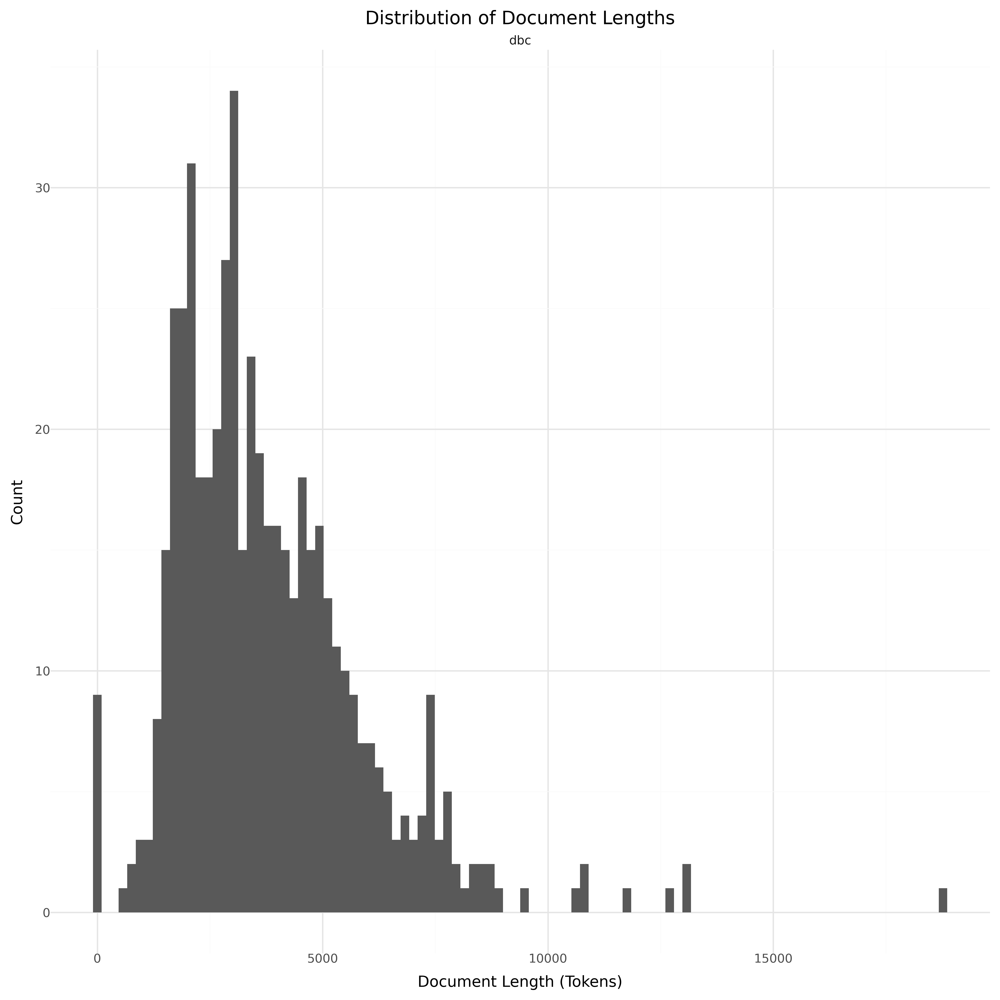

# Dataset Card for DBC D1G1TAL - Faktalink

<!-- START-SHORT DESCRIPTION -->
dbc-faktalink consists of more than 5 hundred articles created by DBC D1G1TAL (former Dansk Bibliotekscenter).
<!-- END-SHORT DESCRIPTION -->

All articles are written in Danish language. Instances that comprise this dataset represent articles on a variety of topics on aspects relevant to Danish society.
The dataset includes articles created between 1991 and 2024.

## Dataset Description

<!-- START-DESC-STATS -->
- **Language**: dan, dansk, Danish
- **Domains**: Books, Encyclopedic
- **Number of samples**: 523
- **Number of tokens (Llama 3)**: 1.99M
- **Average document length (characters)**: 11717.05
<!-- END-DESC-STATS -->

## Dataset Structure
An entry in the dataset consists of the following fields:

- `id` (`str`): An unique identifier for each document.
- `text`(`str`): The content of the document.
- `source` (`str`): The source of the document (see [Source Data](#source-data)).
- `added` (`str`): An date for when the document was added to this collection.
- `created` (`str`): An date range for when the document was originally created.
- `token_count` (`int`): The number of tokens in the sample computed using the Llama 8B tokenizer

### Additional Processing

### Dataset Statistics

<!-- START-DATASET PLOTS -->

<!-- END-DATASET PLOTS -->

# Additional Information

## License Information
Danish Foundation Models have a written agreement with DBC D1G1TAL regarding the use of the data for training and releasing models. 
Data will only be available at the entity during the project. Requests regarding access to the dataset should be directed to the data owner DBC D1G1TAL.

### Citation Information

No citation at the moment.
