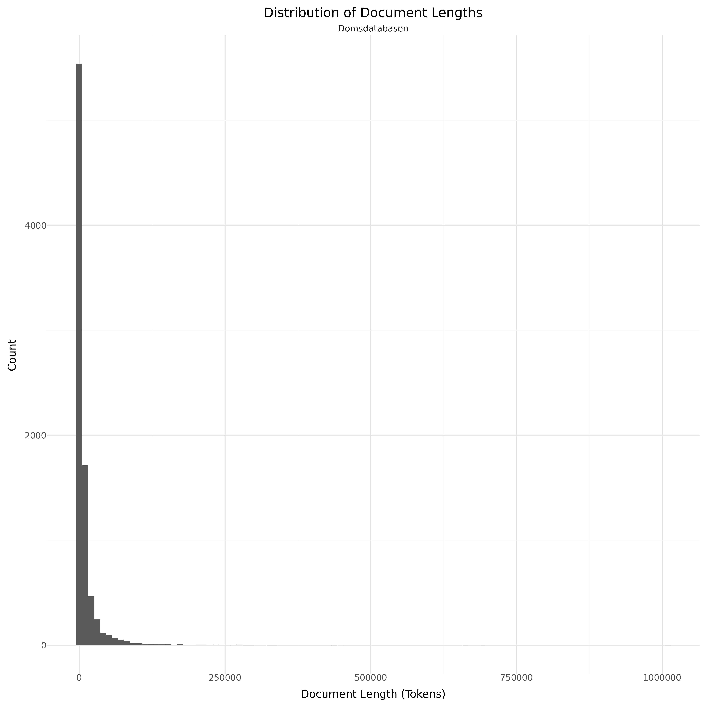

# Dataset Card for Domsdatabasen

<!-- START-SHORT DESCRIPTION -->
Domsdatabasen is a database where you can find and read selected judgments delivered by the Danish Courts.
<!-- END-SHORT DESCRIPTION -->

Each judgment/case consists of tabular data and a case-descriptive PDF. This dataset collects all these cases, with each sample describing a specific judgment/case.

The PDFs are anonymized to protect sensitive information. Therefore, each sample includes two text versions:

text_anon (with anonymization tags: <anonym>"Some sensitive text"</anonym>).
text (without anonymization tags).
text_anon is read with Easyocr.

text is read with Easyocr or Tika-python depending on the PDF and the anonymization method used.

text_anon will be empty if no anonymization is detected in the PDF.

## Dataset Description

<!-- START-DESC-STATS -->
- **Language**: dan, dansk, Danish
- **Domains**: News
- **Number of samples**: 105.11K
- **Number of tokens (Llama 3)**: 65.44M
- **Average document length (characters)**: 1866.20
<!-- END-DESC-STATS -->

## Dataset Structure
An entry in the dataset consists of the following fields:

- `id` (`str`): An unique identifier for each document.
- `text`(`str`): The content of the document.
- `source` (`str`): The source of the document (see [Source Data](#source-data)).
- `added` (`str`): An date for when the document was added to this collection.
- `created` (`str`): An date range for when the document was originally created.
- `token_count` (`int`): The number of tokens in the sample computed using the Llama 8B tokenizer

### Additional Processing

### Dataset Statistics

<!-- START-DATASET PLOTS -->

<!-- END-DATASET PLOTS -->

# Additional Information

## License Information
As of now the license is unknown. 

### Citation Information

If you use the dataset, please link to the original dataset: https://huggingface.co/datasets/alexandrainst/domsdatabasen