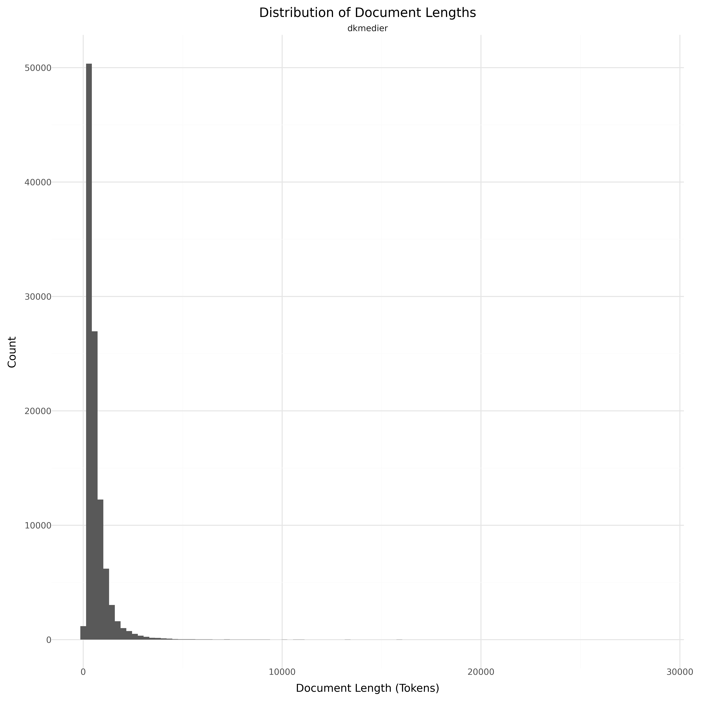

# Dataset Card for DSK - DK Medier

<!-- START-SHORT DESCRIPTION -->
This is the data contributed by DK Medier through the [Dansk Sprogmodel Konsortium](https://alexandra.dk/dsk).
<!-- END-SHORT DESCRIPTION -->

## Dataset Description

<!-- START-DESC-STATS -->
- **Language**: dan, dansk, Danish
- **Domains**: Readaloud, Spoken
- **Number of samples**: 446
- **Number of tokens (Llama 3)**: 7.30M
- **Average document length (characters)**: 38949.78
<!-- END-DESC-STATS -->


## Dataset Structure
An example from the dataset looks as follows.

<!-- START-SAMPLE -->
```py
{
  "id": "INSL20160004",
  "text": "Inspiration nr. 4, 2016\nBiblioteksbetjening \nTelefon: 39 13 46 00\nEmail: biblioteket@nota.dk\nInspira[...]",
  "source": "nota",
  "added": "2025-02-03",
  "created": "2016-01-01, 2016-12-31",
  "token_count": 69977
}
```

### Data Fields

An entry in the dataset consists of the following fields:

- `id` (`str`): An unique identifier for each document.
- `text`(`str`): The content of the document.
- `source` (`str`): The source of the document (see [Source Data](#source-data)).
- `added` (`str`): An date for when the document was added to this collection.
- `created` (`str`): An date range for when the document was originally created.
- `token_count` (`int`): The number of tokens in the sample computed using the Llama 8B tokenizer
<!-- END-SAMPLE -->


### Additional Processing


### Dataset Statistics

<!-- START-DATASET PLOTS -->
<p align="center">

</p>
<!-- END-DATASET PLOTS -->


## Additional Information


### Citation Information

There is currently no citation for this dataset.
