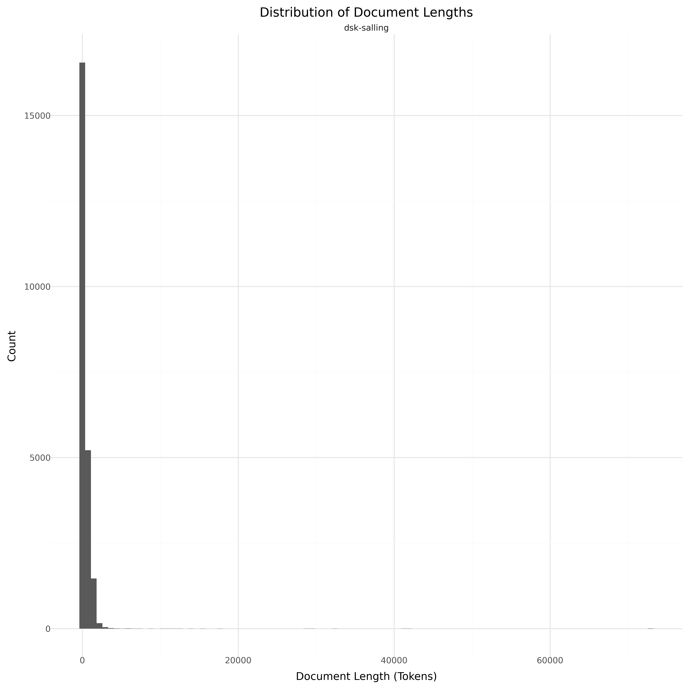

# Dataset Card for DSK - Salling Group

<!-- START-SHORT DESCRIPTION -->
A collection of crawled webpages that is managed by Salling Group. The dataset consists mainly of product pages from online stores such as bilka.dk, br.dk and such. The data consists of ~24K webpages.
<!-- END-SHORT DESCRIPTION -->

The data have been crawled from 11 different domains:
- [sallingfondene.dk](sallingfondene.dk)
- [sallinggroup.com](sallinggroup.com)
- [bilka.dk](bilka.dk)
- [bilkatogo.dk](bilkatogo.dk)
- [bilkamadudafhuset.dk](bilkamadudafhuset.dk)
- [foetex.dk](foetex.dk)
- [foetexudafhuset.dk](foetexudafhuset.dk)
- [netto.dk](netto.dk)
- [br.dk](br.dk)
- [salling.dk](salling.dk)
- [flowr.dk](flowr.dk)

This data has been contributed by Salling Group through the [Dansk Sprogmodel Konsortium](https://alexandra.dk/dsk). 

## Dataset Description

<!-- START-DESC-STATS -->
- **Language**: dan, dansk, Danish
- **Domains**: Web
- **Number of samples**: 24.38K
- **Number of tokens (Llama 3)**: 10.75M
- **Average document length (characters)**: 1277.12
<!-- END-DESC-STATS -->

## Dataset Structure
An entry in the dataset consists of the following fields:

- `id` (`str`): An unique identifier for each document.
- `text`(`str`): The content of the document.
- `source` (`str`): The source of the document (see [Source Data](#source-data)).
- `added` (`str`): An date for when the document was added to this collection.
- `created` (`str`): An date range for when the document was originally created.
- `token_count` (`int`): The number of tokens in the sample computed using the Llama 8B tokenizer

### Additional Processing

### Dataset Statistics

<!-- START-DATASET PLOTS -->

<!-- END-DATASET PLOTS -->

# Additional Information

## License Information
This data is licensed under the data sharing agreement made between the contributor and the Dansk Sprogmodel Konsortium (DSK). 
It allows DFM to use the data for training and releasing models, but prohibits DFM from releasing any of the data, except metadata describing the data. 

### Citation Information

There is currently no citation for this dataset.
