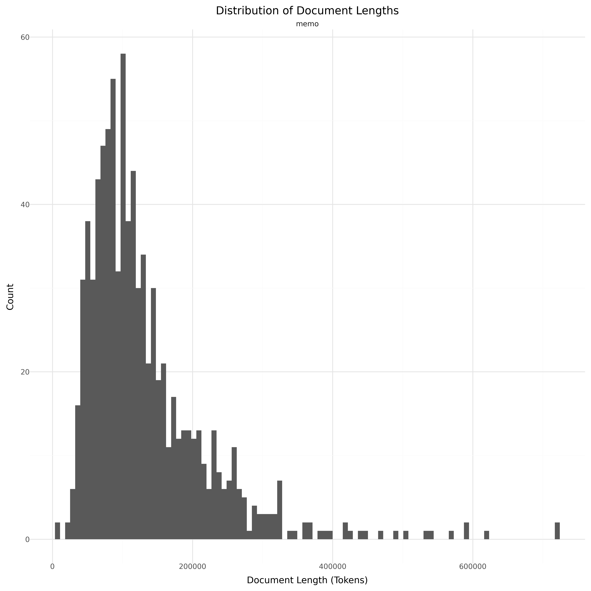

# Dataset Card for MeMo Canonical Novels

<!-- START-SHORT DESCRIPTION -->
The MeMo corpus comprising almost all Danish novels from the period 1870-1899, known as the Modern Breakthrough.
<!-- END-SHORT DESCRIPTION -->

The MeMo corpus is established to investigate literary and cultural change in a seminal epoch of Scandinavian cultural and social history (known as 'the modern breakthrough') using natural language processing and other computational methods. The corpus consists of original novels by Norwegian and Danish authors printed in Denmark in the period 1870-99. It includes 858 volumes, totaling 4.5 million sentences and 65 million words.


Lex.dk is a Danish online encyclopedia platform providing access to reliable and authoritative knowledge on a wide range of topics. It is created and curated by experts, ensuring high-quality, accurate content. The platform serves as a central hub for general and specialized information in Danish, making it a valuable resource for education, research, and general learning.


Additional information about this dataset can be found on their [project page](https://nors.ku.dk/english/research/projects/measuring-modernity/) or on their huggingface [dataset](https://huggingface.co/datasets/MiMe-MeMo/Corpus-v1.1).


## Dataset Description

<!-- START-DESC-STATS -->
- **Language**: dan, dansk, Danish
- **Domains**: Books
- **Number of samples**: 858
- **Number of tokens (Llama 3)**: 110.23M
- **Average document length (characters)**: 371689.87
<!-- END-DESC-STATS -->


## Dataset Structure
An entry in the dataset consists of the following fields:

- `id` (`str`): An unique identifier for each document.
- `text`(`str`): The content of the document.
- `source` (`str`): The source of the document (see [Source Data](#source-data)).
- `added` (`str`): An date for when the document was added to this collection.
- `created` (`str`): An date range for when the document was originally created.
- `token_count` (`int`): The number of tokens in the sample computed using the Llama 8B tokenizer


### Additional Processing


### Dataset Statistics

<!-- START-DATASET PLOTS -->
<p align="center">

</p>
<!-- END-DATASET PLOTS -->


# Additional Information

## License Information


### Citation Information

This dataset is derived from the publicly availabe dataset [MiMe-MeMo/Corpus-v1.1](https://huggingface.co/datasets/MiMe-MeMo/Corpus-v1.1) and was release as a part of paper Bjerring-Hansen, Jens, et al. "Mending Fractured Texts. A heuristic procedure for correcting OCR data." (2022). https://ceur-ws.org/Vol-3232/paper14.pdf. Which has the follwing citation:

```
@inproceedings{bjerring2022mending,
  title={Mending Fractured Texts. A heuristic procedure for correcting OCR data},
  author={Bjerring-Hansen, Jens and Kristensen-McLachlan, Ross Deans and Diderichsen, Philip and Hansen, Dorte Haltrup},
  booktitle={CEUR Workshop Proceedings},
  volume={3232},
  pages={177--186},
  year={2022},
  organization={ceur workshop proceedings}
}
```
