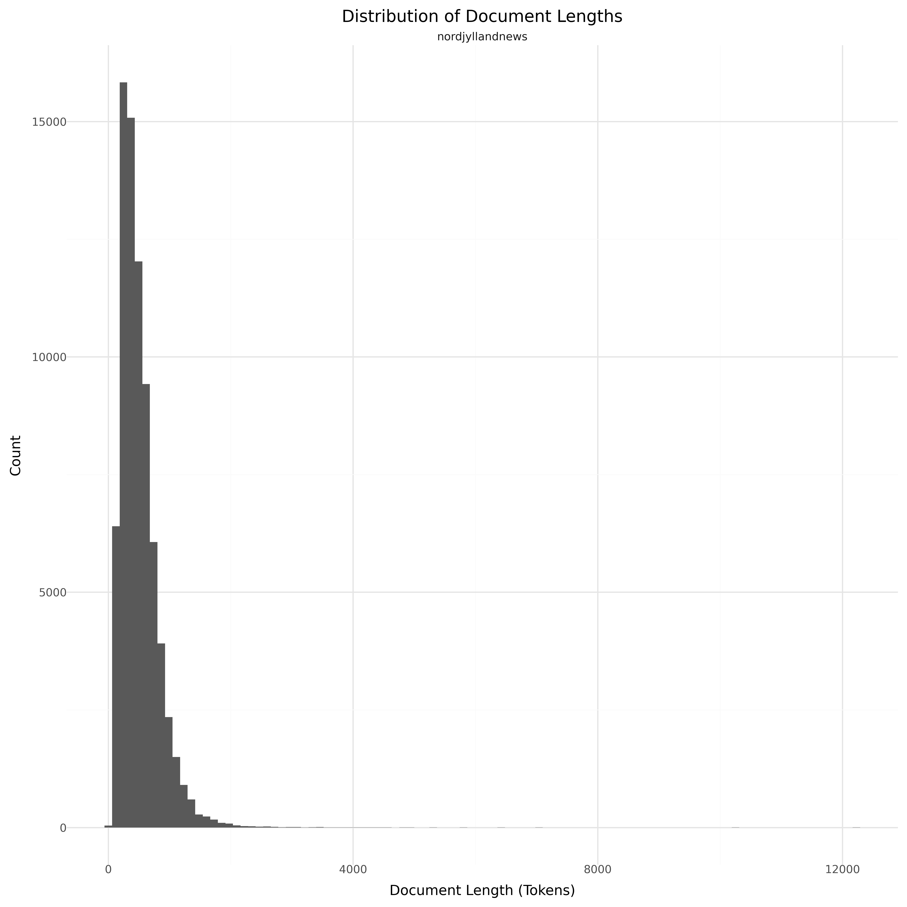

# Dataset Card for Nordjylland News

<!-- START-SHORT DESCRIPTION -->
Articles from the Danish Newspaper [TV2 Nord](https://www.tv2nord.dk).
<!-- END-SHORT DESCRIPTION -->

The data is derived from the Huggingface dataset [alexandrainst/nordjylland-news-summarization](https://huggingface.co/datasets/alexandrainst/nordjylland-news-summarization) originally intended for text summarization.

## Dataset Description

<!-- START-DESC-STATS -->
- **Language**: Danish
- **Domains**: News
- **Number of samples**: 75.22K
- **Number of tokens (Llama 3)**: 37.90M
- **Average document length (characters)**: 1540.29
<!-- END-DESC-STATS -->

## Dataset Structure
An entry in the dataset consists of the following fields:

- `id` (`str`): An unique identifier for each document.
- `text`(`str`): The content of the document.
- `source` (`str`): The source of the document (see [Source Data](#source-data)).
- `added` (`str`): An date for when the document was added to this collection.
- `created` (`str`): An date range for when the document was originally created.
- `token_count` (`int`): The number of tokens in the sample computed using the Llama 8B tokenizer

### Additional Processing

### Dataset Statistics

<!-- START-DATASET PLOTS -->

<!-- END-DATASET PLOTS -->

# Additional Information

## License Information

### Citation Information

No citation is applicable for this work. We recommend citing the huggingface repository.
