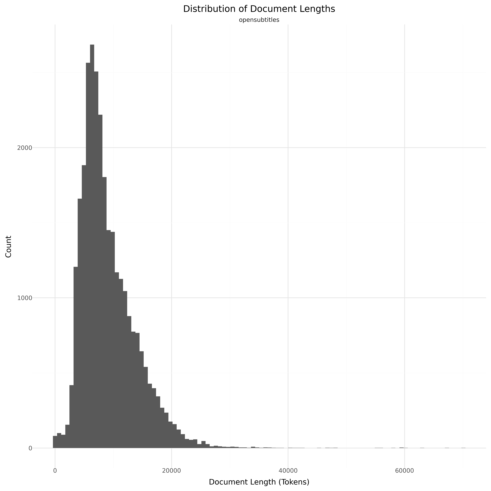

# Dataset Card for OpenSubtitles

<!-- START-SHORT DESCRIPTION -->
Danish subsection of [OpenSubtitles](https://opus.nlpl.eu/OpenSubtitles/corpus/version/OpenSubtitles).
<!-- END-SHORT DESCRIPTION -->

## Dataset Description

<!-- START-DESC-STATS -->
- **Language**: dan, dansk, Danish
- **Domains**: Conversation, Spoken, Subtitles
- **Number of samples**: 29.82K
- **Number of tokens (Llama 3)**: 271.60M
- **Average document length (characters)**: 26298.02
<!-- END-DESC-STATS -->

## Dataset Structure
An entry in the dataset consists of the following fields:

- `id` (`str`): An unique identifier for each document.
- `text`(`str`): The content of the document.
- `source` (`str`): The source of the document (see [Source Data](#source-data)).
- `added` (`str`): An date for when the document was added to this collection.
- `created` (`str`): An date range for when the document was originally created.
- `token_count` (`int`): The number of tokens in the sample computed using the Llama 8B tokenizer

### Additional Processing

### Dataset Statistics

<!-- START-DATASET PLOTS -->

<!-- END-DATASET PLOTS -->

# Additional Information

## License Information

### Citation Information
