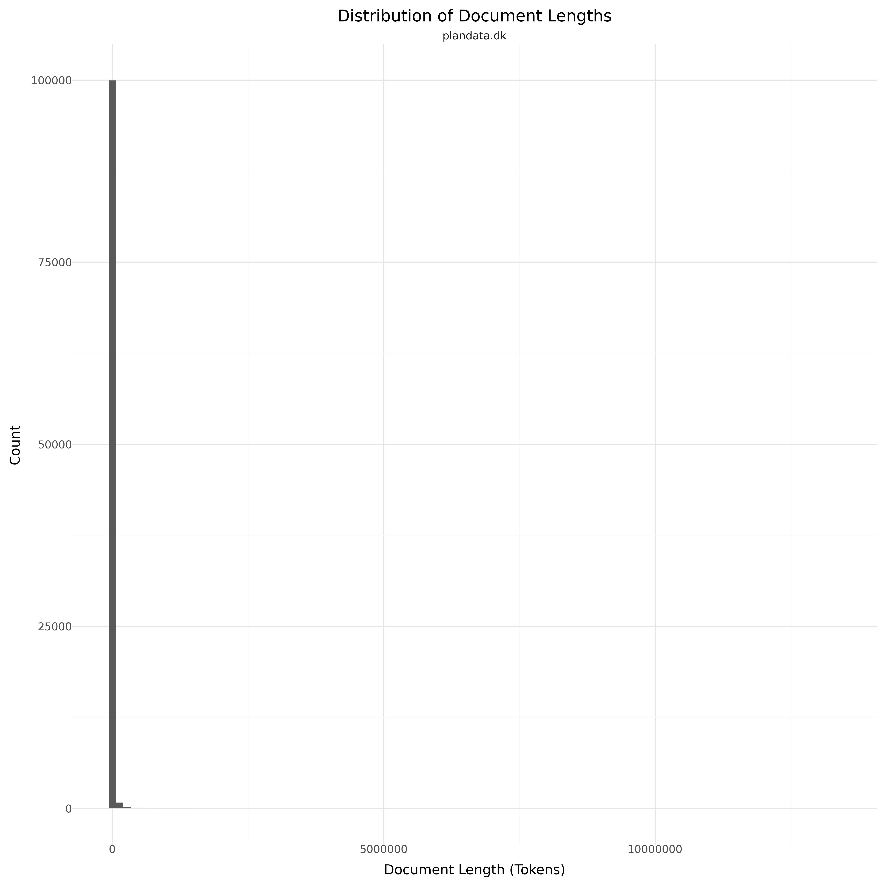

# Dataset Card for Plan- og Landdistriktsstyrelsen - Plandata.dk

<!-- START-SHORT DESCRIPTION -->
A collection of documents pertaining to the planning of municipalities (Lokalplaner), regions, etc. in Denmark.
<!-- END-SHORT DESCRIPTION -->

This dataset consists of current and historical planning documents that outlines the rules for areas in Denmark. 
They are created by various administrative regions such as municipalities.

## Dataset Description

<!-- START-DESC-STATS -->
- **Language**: dan, dansk, Danish
- **Domains**: Legal
- **Number of samples**: 114.28K
- **Number of tokens (Llama 3)**: 1.84B
- **Average document length (characters)**: 57558.79
<!-- END-DESC-STATS -->

## Dataset Structure
An entry in the dataset consists of the following fields:

- `id` (`str`): An unique identifier for each document.
- `text`(`str`): The content of the document.
- `source` (`str`): The source of the document (see [Source Data](#source-data)).
- `added` (`str`): An date for when the document was added to this collection.
- `created` (`str`): An date range for when the document was originally created.
- `token_count` (`int`): The number of tokens in the sample computed using the Llama 8B tokenizer

### Additional Processing

### Dataset Statistics

<!-- START-DATASET PLOTS -->

<!-- END-DATASET PLOTS -->

# Additional Information

## License Information
The license for this is a written agreement with "Plan- og Landdistriktsstyrelsen" that we can use the data for training.

> Plan- og Landdistriktsstyrelsen driver Plandata.dk mens det er kommunerne som planlægningsmyndighed, der udarbejder planerne.
>
> Planerne er offentligt tilgængelige, så dem henter I bare.

### Citation Information

No citation available.
