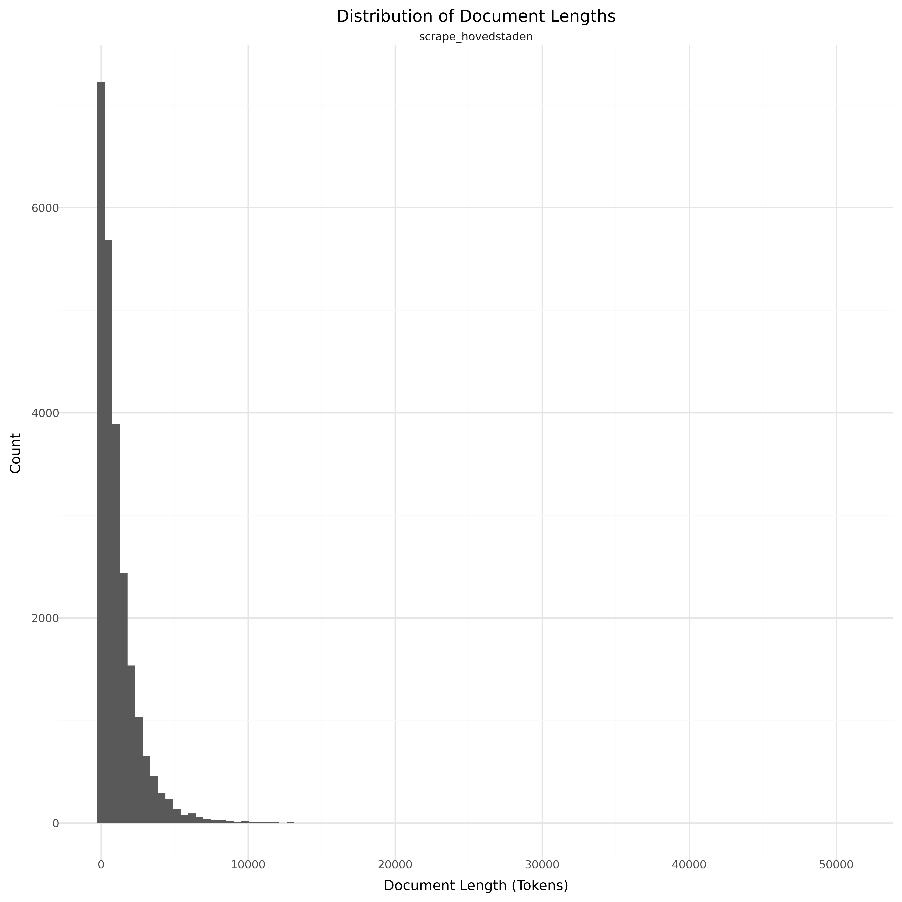

# Dataset Card for Scrape fra dokumentsamling på Vip Region Hovedstaden

<!-- START-SHORT DESCRIPTION -->
Digitaliseringsstyrelsen udgiver ét datasæt på baggrund af offentliggjorte tekster fra Region Hovedstadens dokumentsamling.
<!-- END-SHORT DESCRIPTION -->

Dokumentsamlingen består af vejledninger og oplysningsdokumenter til sundhedsfagligt personale i Region Hovedstaden. Dokumenterne indeholder derfor en række fagbegreber og -termer som hyppigt forekommer inden for sundhedssektoren.

Korpusset indeholder 9.941.236 tokens (orddeling ved mellemrum) trukket fra 15.829 dokumenter og 8923 tabeller.

Korpusset er blevet skabt på baggrund af teksterne i dokumentsamlingen og er blevet efterbehandling, således at teksterne kan anvendes til udvikling af sprogteknologi.

Martin Sundahl Laursen og Thiusius R. Savarimuthu Syddansk Universitet har hjulpet Digitaliseringsstyrelsen med efterbehandlingen af data. Læs deres fælles papir vedr. Automatic Annotation of Training Data for Deep Learning Based De-identification of Narrative Clinical Text..

Der gøres opmærksom på, at korpusset er udviklet med henblik på udvikling af sprogteknologi og må ikke bruges som sundhedsfaglig informationskilde. Dokumenterne er scrapet på et specifikt tidspunkt og vil derfor ikke være ajourført med ændringer. Der henvises i den forbindelse til Region Hovedstadens dokumentsamling.


## Dataset Description

<!-- START-DESC-STATS -->
- **Language**: dan, dansk, Danish
- **Domains**: Encyclopedic
- **Number of samples**: 24.00K
- **Number of tokens (Llama 3)**: 27.04M
- **Average document length (characters)**: 3328.91
<!-- END-DESC-STATS -->


## Dataset Structure
An entry in the dataset consists of the following fields:

- `id` (`str`): An unique identifier for each document.
- `text`(`str`): The content of the document.
- `source` (`str`): The source of the document (see [Source Data](#source-data)).
- `added` (`str`): An date for when the document was added to this collection.
- `created` (`str`): An date range for when the document was originally created.
- `token_count` (`int`): The number of tokens in the sample computed using the Llama 8B tokenizer


### Additional Processing


### Dataset Statistics

<!-- START-DATASET PLOTS -->
<p align="center">

</p>
<!-- END-DATASET PLOTS -->


# Additional Information

## License Information
Udgivet under en CC-0 licens.

### Citation Information

If you are using the data please reference the following paper:

```
@inproceedings{laursen2023automatic,
  title={Automatic Annotation of Training Data for Deep Learning Based De-identification of Narrative Clinical Text},
  author={Laursen, Martin Sundahl and Pedersen, Jannik Skyttegaard and Vinholt, Pernille and Savarimuthu, Thiusius R},
  booktitle={The First Workshop on Context-aware NLP in eHealth:(WNLPe-Health 2022)},
  pages={30--44},
  year={2023},
  organization={CEUR Workshop Proceedings}
}
```
